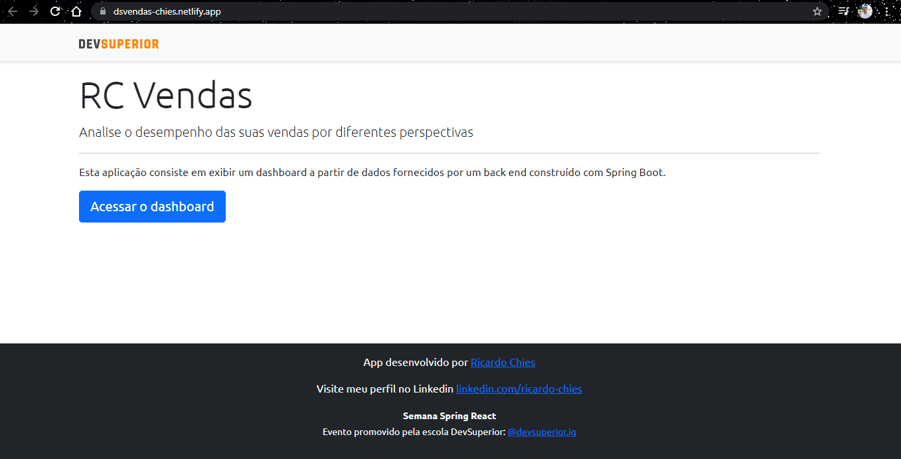
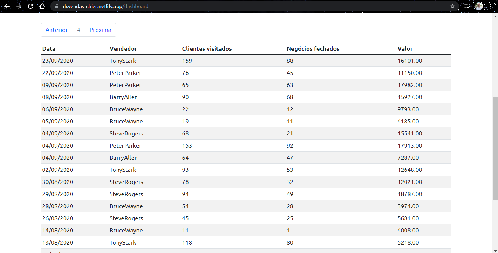
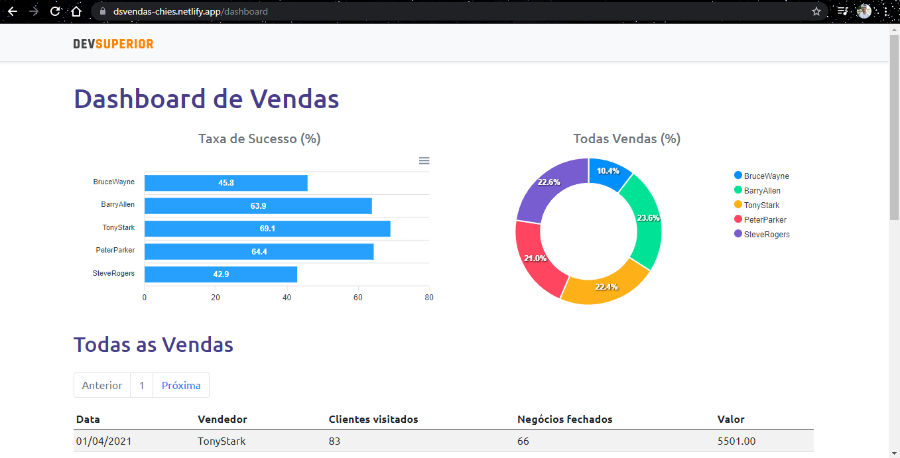

# Projeto Semana Spring React

# Descrição
Este projeto consiste em um app que mostra os dados das vendas de determinados funcionários em um período.

Visual estátido do front end montado em React;  

  

Implementação de back end em Spring Boot;  
Implantação na nuvem;  

  

Consultas agrupadas para gráficos;  
App publicado no Netlify https://dsvendas-chies.netlify.app 

  

